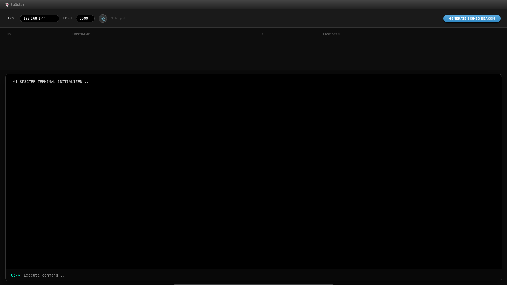

<div align="center">
  <br />
      
    </a>
  <br />

  <div>
    
    
    
  </div>

  <h3 align="center">SP3CTER - Shadow Command & Control System</h3>

   <div align="center">
     SP3CTER es un Framework C2 (Command & Control) ligero y potente diseñado para operaciones de Red Team en entornos Windows. Cuenta con una interfaz táctica Aqua-Dark y un sistema de generación de beacons con técnicas de evasión y clonado de firmas.
    </div>
</div>

## Características

- **Servidor C2 Core**
  - Basado en Flask con autenticación dinámica por contraseña (operación en memoria).

- **Generador de Beacons**
  - Compilación dinámica de agentes en C# (.NET).

- **PE Signature Hijacking**
  - Capacidad de clonar certificados digitales de ejecutables legítimos para evadir motores de detección.
    
- **Técnica de Bloating**
  - Inyección de datos basura (junk data) para inflar el tamaño del binario y saltar escaneos rápidos de antivirus.

- **Panel de Control Aqua**
  - Interfaz web interactiva para la gestión de múltiples agentes, ejecución de comandos remotos y recepción de resultados.
    
- **Exfiltración de Datos**
  - Soporte nativo para descarga de archivos desde el host objetivo directamente al panel de control.

---

## Instalación (Kali Linux / Parrot OS)

Este proyecto está optimizado para distribuciones de seguridad. El instalador automático configurará el compilador Mono y todas las dependencias necesarias de Python:

### Setup

```bash
git clone https://github.com/usuario/sp3cter.git
cd sp3cter
chmod +x install.sh
sudo ./install.sh
```

---

## Ejecución

```bash
python3 app.py mi_password_secreta!$
```

Abrir en navegador:

```text
http://localhost:5000
```

---

## Estructura

```text
sp3cter/
│
├── app.py
├── install.sh
├── signatures/
│   ├── chr.exe
│   └── fox.exe
├── assets/
│   ├── login.png
│   ├── dashboard.png
│   └── banner.png
├── templates/
│   ├── index.html
│   └── login.html
└── README.md
```

---

## Dashboard

Agrega aquí una captura:

```md

```

---

Aviso Legal

Este software ha sido creado con fines exclusivamente educativos y para pruebas de penetración autorizadas. El uso de SP3CTER contra objetivos sin consentimiento previo es ilegal y está penado por la ley. El desarrollador no se hace responsable del mal uso de esta herramienta.

---

## Developed by ALLPA-SEC Team 
